# Jarkom_Modul2_Praktikum_B07

## Kelompok
* 05111840000060 Edo Dwi Yogatama 
* 05111840000091 Vincentius Tanubrata

#### 1. Kalian diminta untuk membuat sebuah website utama dengan alamat **http://semeruyyy.pw**
* install bind9 dengan
```
apt-get update
apt-get install bind9 -y
```
* buatlah domain semerub07.pw pada UML MALANG dengan
```
nano /etc/bind/named.conf.local
```
* lalu buatlah zone semerub07.pw dengan syntax sebagai berikut
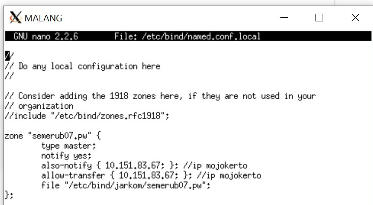
* buat folder jarkom pada /etc/bind lalu copy file db.local ke path /etc/bind/jarkom/ dan ubah namanya menjadi semerub07.pw
```
mkdir /etc/bind/jarkom
cp /etc/bind/db.local /etc/bind/jarkom/semerub07.pw
```
* buka file /etc/bind/jarkom/semerub07.pw dan ubah syntaxnya menjadi berikut
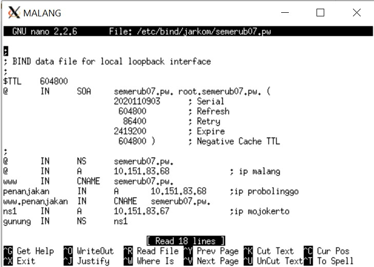
* restart bind9 dengan melakukan `service bind9 restart`
* Kemudian setting pada client GRESIK dan SIDOARJO untuk mengarahkan nameserver menuju IP MALANG dengan membuka `/etc/resolv.conf`
* Terakhir, untuk melakukan test, lakukan `ping semerub07.pw` dari client GRESIK atau SIDOARJO
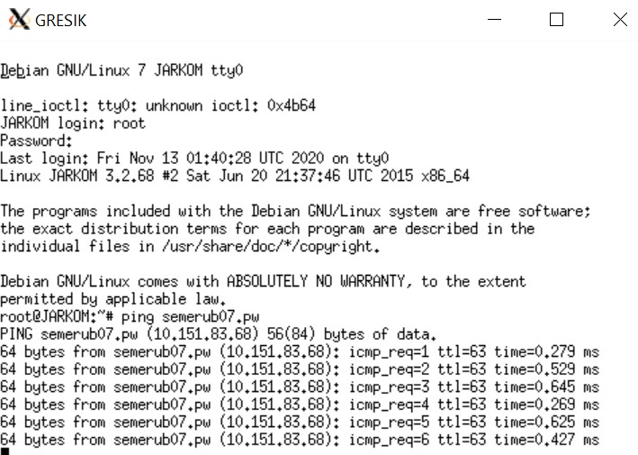

#### 2. yang memiliki alias **http://www.semeruyyy.pw**
* untuk menambahkan alias, kita perlu menambahkan CNAME pada file `/etc/bind/jarkom/semerub07.pw` seperti berikut

* kemudian kita restart bind dengan `service bind9 restart` 
* untuk test, kita bisa melakukan `ping www.semerub07.pw` pada client GRESIK
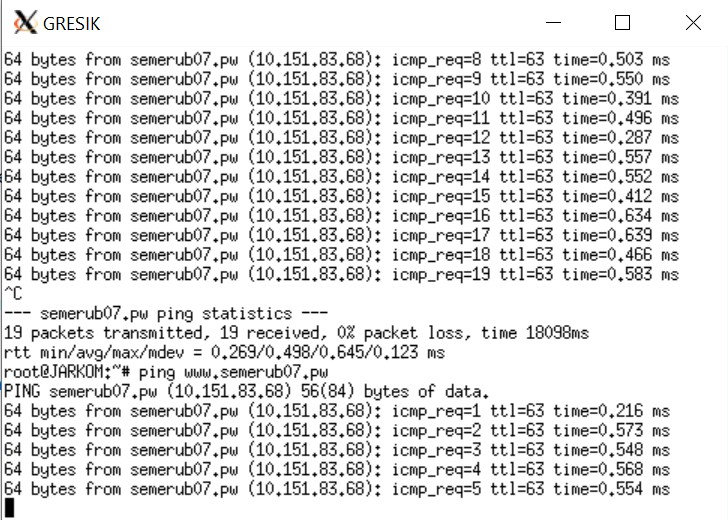

#### 3. dan subdomain **http://penanjakan.semeruyyy.pw** yang diatur DNS-nya pada **MALANG** dan mengarah ke IP Server **PROBOLINGGO**
* untuk subdomain, pertama kita tambahkan konfigurasi pada file `/etc/bind/jarkom/semerub07.pw` dengan menambahkan subdomain penanjakan dan kita arahkan ke IP server PROBOLINGGO

* lalu kita restart bind dengan `service bind9 restart` 
* untuk test, kita bisa melakukan `ping penanjakan.semerub07.pw` pada client GRESIK
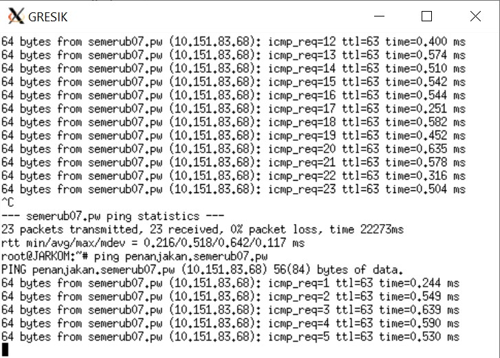

#### 4. serta dibuatkan reverse domain untuk domain utama.
* untuk reverse domain, pertama kita buka file dibawah ini pada uml MALANG
```
nano /etc/bind/named.conf.local
```
* lalu kita tambahkan konfigurasi seperti berikut
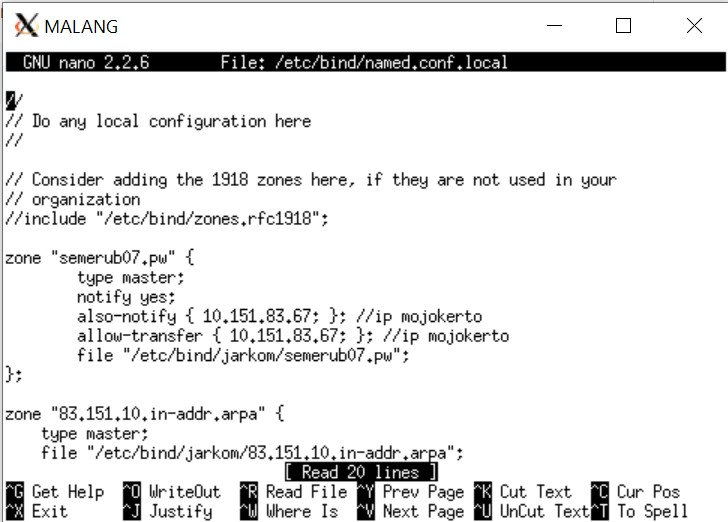

* lalu kita copy file db.local kedalam folder jarkom dan diubah namanya menjadi
```
cp /etc/bind/db.local /etc/bind/jarkom/83.151.10.in-addr.arpa
```
* lalu kita ubah isi dari file `83.151.10.in-addr.arpa` tersebut dengan menambahkan PTR yang mengarah ke ip MALANG
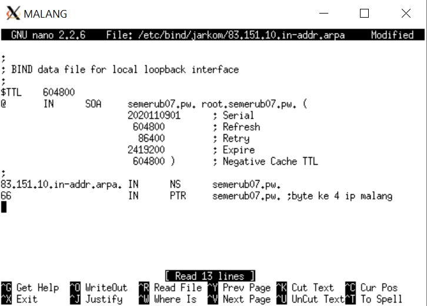
* restart bind dengan `service bind9 restart`
* untuk mengecek, pada client GRESIK install dnsutils
```
apt-get update
apt-get install dnsutils
```
* lalu kembalikan name server agar tersambung ke IP MALANG
```
host -t PTR 10.151.83.66
```
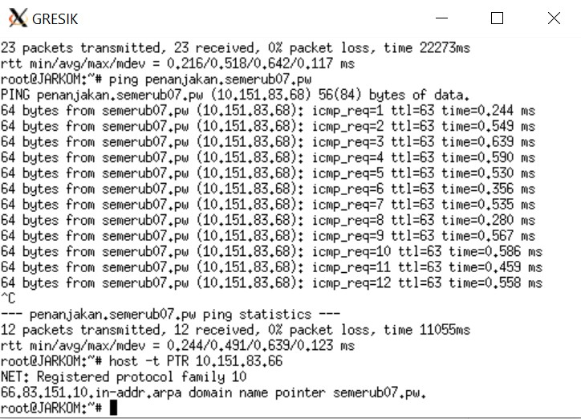

#### 5. Untuk mengantisipasi server dicuri/rusak, Bibah minta dibuatkan DNS Server Slave pada **MOJOKERTO** agar Bibah tidak terganggu menikmati keindahan Semeru pada Website.
* untuk dns slave, pertama kita buka `/etc/bind/named.conf.local` dan atur syntaxnya menjadi berikut

* lakukan restart bind dengan `service bind9 restart`
* buka uml MOJOKERTO lalu install bind9 dengan
```
apt-get update
apt-get install bind9 -y
```
kemudian buka `/etc/bind/named.conf.local` pada MOJOKERTO dan atur menjadi berikut
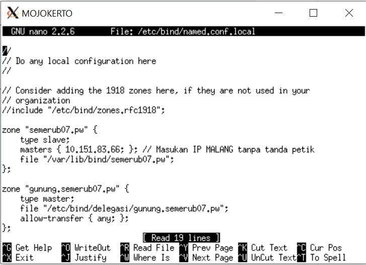
* lakukan restart bind dengan `service bind9 restart`
* untuk testing, stop bind9 pada malang dengan `service bind9 stop`
* lalu pada client GRESIK arahkan nameserver ke IP MALANG dan IP MOJOKERTO
* dan untuk testing, lakukan ping semerub07 pada client GRESIK
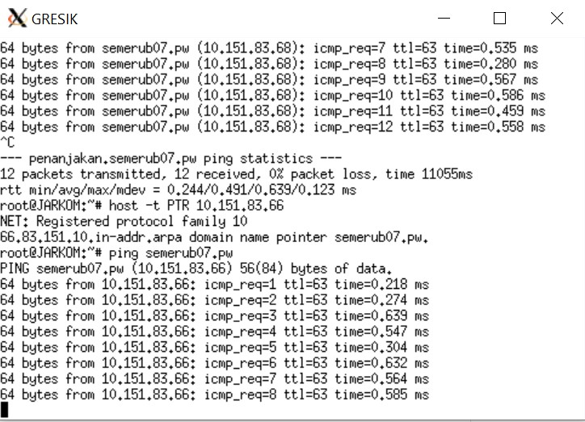

#### 6. Selain website utama Bibah juga meminta dibuatkan subdomain dengan alamat **http://gunung.semeruyyy.pw** yang didelegasikan pada server **MOJOKERTO** dan mengarah ke IP Server **PROBOLINGGO**.
* untuk delegasi subdomain 'gunung.semerub07.pw' , pertama buka file `/etc/bind/jarkom/semerub07.pw` pada MALANG dan tambahkan seperti berikut

* edit file `/etc/bind/named.conf.options` dan comment `dnssec-validation auto;` serta tambahkan `allow-query{any;};`
* lalu ubah syntax pada `/etc/bind/named.conf.local` di MALANG menjadi berikut

* restart bind9 dengan `service bind9 restart`
* pada MOJOKERTO buka file `/etc/bind/named.conf.options` dan comment `dnssec-validation auto;` serta tambahkan `allow-query{any;};`
* lalu edit `/etc/bind/named.conf.local` menjadi seperti berikut

* kemudian buat file bernama delegasi dan copy db.local ke file delegasi tersebut dan ganti namanya menjadi
```
mkdir /etc/bind/delegasi
cp /etc/bind/db.local /etc/bind/delegasi/gunung.semerub07.pw
```
* kemudian edit file `gunung.semerub07.pw` menjadi berikut
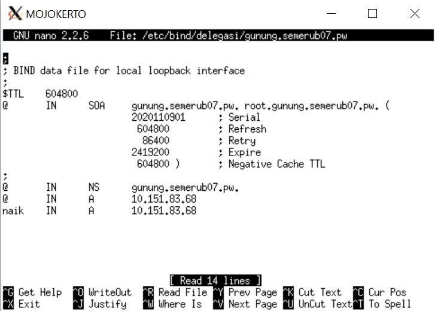
lakukan restart bind9 dengan `service bind9 restart`
* untuk testing lakukan `ping gunung.semerub07.pw`
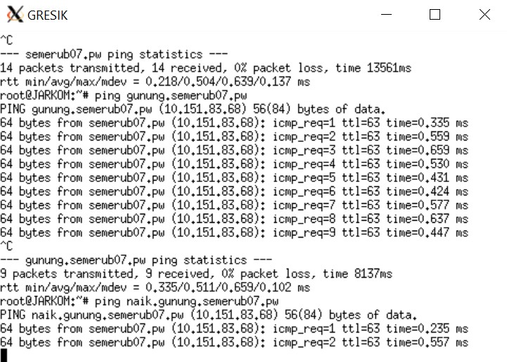

#### 7. Bibah juga ingin memberi petunjuk mendaki gunung semeru kepada anggota komunitas sehingga dia meminta dibuatkan subdomain dengan nama **http://naik.gunung.semeruyyy.pw**, domain ini diarahkan ke IP Server **PROBOLINGGO**. 
* untuk pembuatan subdomain `naik.gunung.semerub07.pw` langkah awalnya mirip pada nomor 6.
* Namun pada file `gunung.semerub07.pw` di MOJOKERTO, tambahkan 1 subdomain lagi yaitu naik yang mengarah ke IP PROBOLINGGO

* lalu test pada client GRESIK dengan melakukan `ping naik.gunung.semerub07.pw`


#### 8. Setelah selesai membuat keseluruhan domain, kamu diminta untuk segera mengatur web server. Domain **http://semeruyyy.pw** memiliki _DocumentRoot_ pada **/var/www/semeruyyy.pw**
* Pada UML PROBOLINGGO menginstall apache2 dan php5 dengan command :
```
apt-get update
apt-get install apache2
apt-get install php
```
* Setelah itu mendowndload dan _unzip_ folder website yang telah tersedia (Install unzip apabila belum terinstall di UML PROBOLINGGO)
* Pindah direktori ke **/etc/apache2/sites-available**
* Mengcopy file konfigurasi **default** dengan nama **semerub07.pw** setelah itu buka file dan mengganti konfigurasi seperti dibawah
```
cd /etc/apache2/sites-available
cp default semerub07.pw
nano semerub07.pw
```

* Pindah direktori ke **/var/www/**, setelah itu move folder yang sudah diekstrak dari hasil download direktori tersebut, dan memberi nama folder **semerub07.pw**
* Jalankan command sebgai berikut untuk enable konfigurasi website
```
a2ensite semerub07.pw
service apache2 restart
```
#### 9. Awalnya web dapat diakses menggunakan alamat **http://semeruyyy.pw/index.php/home**. Karena dirasa alamat urlnya kurang bagus, maka diaktifkan mod rewrite agar urlnya menjadi **http://semeruyyy.pw/home**.
* Membuka folder **/var/www/semerub07.pw** lalu membuat file **.htaccess** dan berisikan sebagai berikut
```
cd /var/www/semerub07.pw
nano .htaccess
``` 

* Setelah itu membuka file konfigurasi di **/etc/apache2/sites-available/semerub07.pw** dan menambahkan script berikut
```
cd /etc/apache2/sites-available
nano semerub07.pw
```

* Jalankan command sebgai berikut untuk enable konfigurasi website
```
a2ensite semerub07.pw
service apache2 restart
```
#### 10. Web **http://penanjakan.semeruyyy.pw** akan digunakan untuk menyimpan assets file yang memiliki _DocumentRoot_ pada **/var/www/penanjakan.semeruyyy.pw** dan memiliki struktur folder sebagai berikut: 
```
/var/www/penanjakan.semeruyyy.pw 
                                /public/javascripts 
                                /public/css 
                                /public/images 
                                /errors
```
* Pindah direktori ke **/etc/apache2/sites-available**
* Mengcopy file konfigurasi **default** dengan nama **penanjakan.semerub07.pw** setelah itu buka file dan mengganti konfigurasi _ServerName ServerAlias DocumentRoot_ seperti dibawah
```
cd /etc/apache2/sites-available
cp default penanjakan.semerub07.pw
nano penanjakan.semerub07.pw
``` 

* Pindah direktori ke **/var/www/**, setelah itu move folder yang sudah diekstrak dari hasil download direktori tersebut, dan memberi nama folder **penanjakan.semerub07.pw**
* Jalankan command sebgai berikut untuk enable konfigurasi website
```
a2ensite penanjakan.semerub07.pw
service apache2 restart
```
#### 11. Pada folder */public* dibolehkan directory listing namun untuk folder yang berada di dalamnya tidak dibolehkan. 
* Menambahkan konfigurasi pada file **/etc/apache2/sites-available/penanjakan.semerub07.pw** untuk indexing directory seperti berikut

#### 12. Untuk mengatasi HTTP Error code 404, disediakan file 404.html pada folder **/errors** untuk mengganti error default 404 dari Apache
* Membuka folder **/var/www/penanjakan.semerub07.pw** lalu membuat file **.htaccess** dan berisikan sebagai berikut
```
cd /var/www/penanjakan.semerub07.pw
nano .htaccess
``` 

* Setelah itu membuka file konfigurasi di **/etc/apache2/sites-available/penanjakan.semerub07.pw** dan menambahkan script berikut
```
cd /etc/apache2/sites-available
nano penanjakan.semerub07.pw
```

* Jalankan command sebgai berikut untuk enable konfigurasi website
```
a2ensite penanjakan.semerub07.pw
service apache2 restart
```
#### 13. Untuk mengakses file assets javascript awalnya harus menggunakan url **http://penanjakan.semeruyyy.pw/public/javascripts**. Karena terlalu panjang maka dibuatkan konfigurasi virtual host agar ketika mengakses file assets menjadi **http://penanjakan.semeruyyy.pw/js**. 
* Membuka file konfigurasi pada **/etc/apache2/sites-available/penanjakan.semerub07.pw**
* Menambahkan _Alias_ pada script konfigurasi sebagai berikut

* Jalankan command sebgai berikut untuk enable konfigurasi website
```
a2ensite penanjakan.semerub07.pw
service apache2 restart
```
#### 14. Untuk web **http://gunung.semeruyyy.pw** belum dapat dikonfigurasi pada web server karena menunggu pengerjaan website selesai. sedangkan web **http://naik.gunung.semeruyyy.pw** sudah bisa diakses hanya dengan menggunakan port **8888**. DocumentRoot web berada pada **/var/www/naik.gunung.semeruyyy.pw**.
* Membuka folder **/etc/apache2/sites-available/**
* Mengcopy file **default** menjadi **naik.gunung.semerub07.pw**
* Buka file **naik.gunung.semerub07.pw** dan mengganti port pada _VirtualHost_ dan juga mengedit _DocumentRoot_ nya seperti berikut

* Kembali pada direktori **/etc/apache2/** dan membuka file **ports.conf**, tambahkan script untuk menerima port 8888

* Move folder dari hasil ekstrak ke **/var/www** dengan nama naik.gunung.semerub07.pw
* Jalankan command sebgai berikut untuk enable konfigurasi website
```
a2ensite penanjakan.semerub07.pw
service apache2 restart
```
#### 15. Dikarenakan web **http://naik.gunung.semeruyyy.pw** bersifat private Bibah meminta kamu membuat web **http://naik.gunung.semeruyyy.pw** agar diberi autentikasi password dengan username **“semeru”** dan password **“kuynaikgunung”** supaya aman dan tidak sembarang orang bisa mengaksesnya.
* Pindah direktori ke **/var/www/naik.gunung.semeru.pw** Dan tambahkan file **.htaccess** di dalam direktori tersebut. Mengisi nya dengan script sebagai berikut
```
cd /var/www/naik.gunung.semerub07.pw
nano .htaccess
```

* Edit file konfigurasi pada **/etc/apache2/sites-available/naik.gunung.semeru.pw** dengan menambahkan script berikut

#### 16. Saat Bibah mengunjungi **IP PROBOLINGGO**, yang muncul bukan web utama **http://semeruyyy.pw** melainkan laman default Apache yang bertuliskan “It works!”. Karena dirasa kurang profesional, maka setiap Bibah mengunjungi IP PROBOLINGGO akan dialihkan secara otomatis ke **http://semeruyyy.pw**. 

#### 17. Karena pengunjung pada **/var/www/penanjakan.semeruyyy.pw/public/images** sangat banyak maka semua request gambar yang memiliki substring **“semeru”** akan diarahkan menuju **semeru.jpg**
